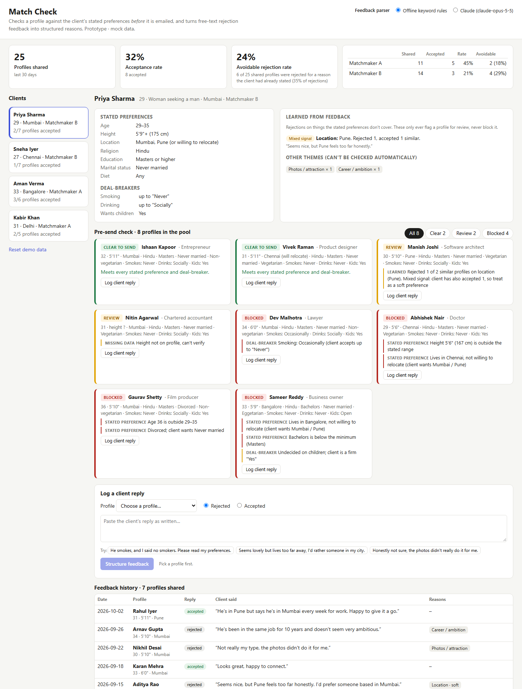

# Match Check

A pre-send profile check and rejection-feedback structurer for matchmakers. Built for The Date Crew's Product & Tech Generalist assessment.

- **Live demo:** [https://jatanrajbhar.github.io/match-check/](https://jatanrajbhar.github.io/match-check/)
- **Written answers (Parts 1–4):** [docs/answers.md](docs/answers.md), also as a [PDF](docs/The-Date-Crew-Assessment-Answers.pdf)

## The problem in one number

About 35% of the 690 monthly rejections are for something the client had already told us. That is **≈241 profiles a month, 24% of everything we send**, that were a guaranteed "no". Match Check stops those before they are emailed and turns free-text rejections into structured reasons, so the next search can use them.

## What the prototype does

| | |
|---|---|
| **Pre-send check** | Every unsent profile is marked **Clear**, **Review** or **Blocked** against the client's stated preferences and deal-breakers, with the reason shown. |
| **Feedback structuring** | A client's free-text reply becomes reasons from a 16-category taxonomy, each with a quote, firmness and direction. It uses Claude if you add an API key, or offline keyword rules otherwise. |
| **Avoidable or not** | Code (not the model) decides whether a rejection broke a stated preference, which means the check would have caught it. |
| **Learned signals** | Repeated rejections on things the stated preferences don't cover ("rejected 2 of 2 profiles 5'6" or shorter") flag similar profiles for review. They never block, and they show counter-evidence, because some clients reject and later accept very similar profiles. |
| **Team metrics** | Acceptance and avoidable-rejection rate per matchmaker. |



### Things to try

- **Priya:** Dev is blocked (smoker vs a no-smoking deal-breaker) and Manish is flagged as a *mixed signal*: she rejected one Pune profile, then accepted another.
- **Sneha:** Abhishek is flagged because she rejected two shorter men, though she never stated a height preference.
- **Kabir:** log a reply for Simran such as *"Gurgaon again, the commute is too much"*, then watch the Gurgaon signal go from a single data point to a consistent pattern.

Deep links: `?client=c2` selects a client. `?client=c1&profile=p2&reply=He+smokes` pre-fills and structures a reply.

## Run it

No build step and no dependencies for the app itself.

```bash
python -m http.server 8000          # then open http://localhost:8000
node --test                         # 10 unit tests for the engine (Node 18+)
python analysis/funnel_analysis.py  # every number used in the written answers
npm install && npm run pdf          # rebuild the answers PDF (needs Chrome or Edge)
```

Opening `index.html` directly also works for the offline parser.

## Using Claude

Choose **Claude** at the top right and paste an Anthropic API key. The key stays in `sessionStorage` for that tab, and requests go straight from the browser to `api.anthropic.com` through the official SDK (`@anthropic-ai/sdk`, loaded from jsDelivr). The request uses `claude-opus-5-5` with a JSON-schema structured output and `effort: "low"`, and has server-side refusal fallback enabled (`fallbacks: "default"`). If the call fails, the app shows the error and falls back to the offline parser.

Calling the API from a browser is only acceptable for a demo where people bring their own key. In production this call belongs on a small backend, or in a nightly Message Batches job over the reply inbox.

## Layout

```
index.html                 the app
src/engine.js              rules, offline parser, avoidability, learned signals, metrics (pure functions)
src/claude.js              Claude feedback parser (structured output)
src/app.js, styles.css     UI
src/data.js                mock clients, profiles and 25 replies matching the brief's ratios
tests/engine.test.js       unit tests
analysis/funnel_analysis.py  funnel maths, projections, two-week significance check
docs/                      written answers, PDF, screenshots
scripts/build-pdf.mjs      answers.md -> PDF
```

## Design decisions

- **Rules decide, AI describes.** Blocking is deterministic code that is explainable, instant and free. Claude only turns free text into the fixed taxonomy, and code computes avoidability from that.
- **Learned preferences warn, never block.** The brief notes clients who reject a profile and later accept a similar one, so learned signals carry counter-evidence and need the client's confirmation before they become stated preferences.
- **Missing data means review, not pass.** A profile without a height can't silently clear a height preference.

## Limitations

- All data is mock data, and changes are kept in memory only (use "Reset demo data").
- The offline parser is keyword-based and exists so the demo runs without a key.
- The Claude path is verified up to authentication: with an invalid key it returns a handled 401. It has not been run with a live key.
- There is no authentication, persistence or email integration. Those are part of the two-week plan in the written answers.
