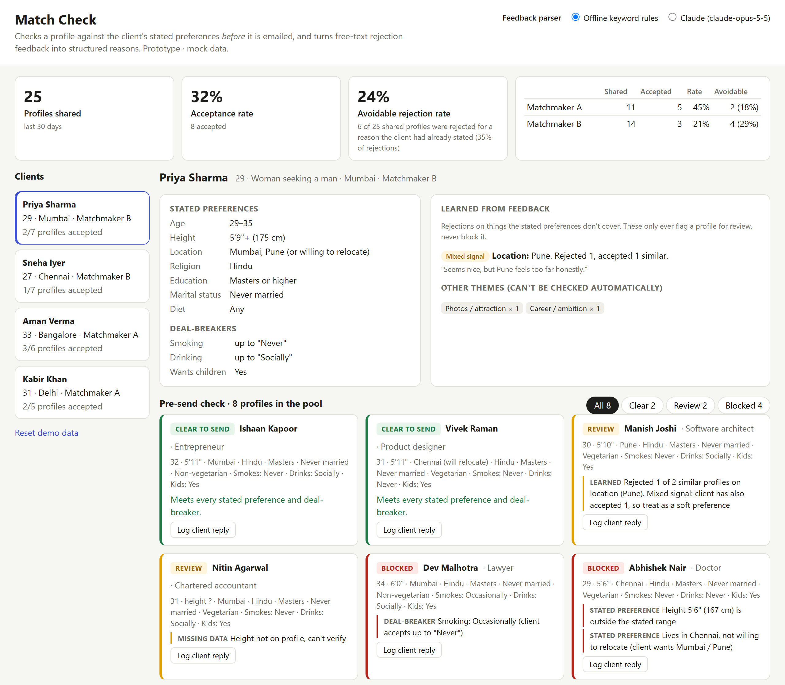
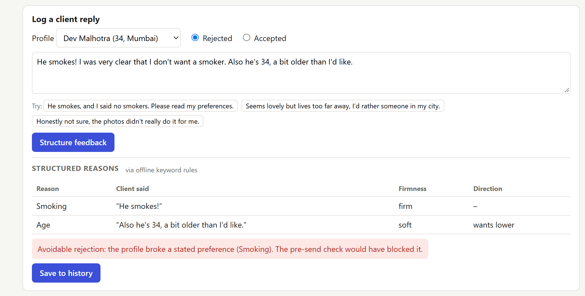

# The Date Crew: Product & Tech Generalist Assessment

**Prototype (live):** [https://jatanrajbhar.github.io/match-check/](https://jatanrajbhar.github.io/match-check/) &nbsp;·&nbsp; **Code:** [github.com/jatanrajbhar/match-check](https://github.com/jatanrajbhar/match-check) &nbsp;·&nbsp; Every number below is reproduced by `analysis/funnel_analysis.py` (see the appendix for the full table and assumptions).

---

## Part 1: Diagnose the problem

### 1. Three questions I would investigate

**a. Which profiles get rejected, and why?** 690 of 1,000 profiles (69%) are rejected, the largest drop in the funnel. Feedback is free text, so nobody can say which reasons dominate and every fix is a guess. Structured reasons would also show whether the 35% "already in preferences" rejections cluster on a few fields.

**b. Are the same profiles circulated to many clients?** Over-shared profiles get fatigued and decline more, which may explain part of the 310 → 210 drop after clients say yes (assuming that step needs mutual consent). It is also unfair to less-exposed members.

**c. Do matchmakers recommend the same "type" to every client?** A converts 44%, B 21%. If A tailors and B sends a template type, part of the fix is coaching, not software (after controlling for client mix). The numbers imply B sends *more* profiles than A (≈565 vs ≈435).

### 2. The biggest problem

The quality and relevance of what we send at the top of the funnel, caused by the absence of a learning loop. Profiles are shared without being checked against stated preferences, and rejection feedback is not captured in a form that improves the next recommendation.

In numbers: 35% of 690 ≈ **241 rejections a month, 24% of everything we send, were for something the client had already told us.**

*Assumptions:* the counts are one 30-day cohort; the 35% applies to all rejections; later steps convert at 50–71%, so fixes at the top multiply through them.

### 3. Three metrics

1. **Meetings completed per matchmaker-hour** (north star). Hours aren't logged yet, so instrument them. Assuming 100 clients at 2 h/week: ≈857 search hours for 42 meetings.
2. **Avoidable rejection rate**: rejections for a reason already in stated preferences ÷ profiles shared. Today ≈24%. A leading indicator that moves within days.
3. **Meeting completion rate**: completed ÷ fixed, today 56%. A guardrail that gains reach real meetings; segment no-shows and cancellations by reason.

---

## Part 2: Design a solution

### Problem

One in four profiles we send (≈241 a month) is rejected for a reason the client already gave us: a stated preference or a deal-breaker. Preferences are not checked at the moment of sending, and free-text feedback never becomes something the next search can use.

### User

Matchmakers, at the moment they are about to email a profile. Secondarily the matchmaking lead, who sees the avoidable-rejection rate per matchmaker each week. Clients never see the tool.

### Solution: "Match Check"

1. **Pre-send check (rules, not AI).** Each candidate is compared with the client's stated preferences and deal-breakers. **Blocked** if it breaks one (sending anyway needs a logged reason); **Review** if a field is missing, a deal-breaker is borderline ("open to kids" vs a firm yes) or it matches a learned pattern; otherwise **Clear**. Plain code is explainable, instant and free.
2. **Feedback structuring (AI).** A client's reply becomes structured reasons from a fixed 16-category taxonomy, each with a quote, firmness (firm/soft) and direction ("wants taller"). Code, not the model, then decides if the rejection was avoidable.
3. **Learned signals.** Rejections on checkable fields the stated preferences don't cover become signals, e.g. "rejected 2 of 2 profiles 5'6" or shorter". They only flag for review, never block, and show counter-evidence, because some clients reject a profile and later accept a very similar one. A consistent signal prompts the matchmaker to confirm with the client and add it to the stated preferences, closing the loop.

**Two-week plan.** Days 1–3: import preferences, profiles and the sent log into one table and normalise fields. Days 4–6: rules engine with tests, taxonomy and prompt, backfill 90 days of feedback for a baseline. Days 7–10: internal page (shortlist, reply logging, overrides) and weekly report. Days 11–14: pilot with Matchmaker B (most volume, lowest acceptance) and hand-check 50 parsed replies.

### Data

Client preferences and deal-breakers (structured), candidate profiles with the same fields, the sent log (client, candidate, matchmaker, date), reply text with accept/reject, and later funnel outcomes. Missing fields return "can't verify", never a silent pass.

### Technology

Rules in JavaScript (the prototype runs in the browser). Claude Opus 5.5 via the Anthropic API with JSON-schema structured output, so every answer fits the taxonomy; at roughly 1.5k input and 0.5k output tokens per reply, 700 rejections a month cost about $11. The Message Batches API (half price) for backfills. Postgres or Google Sheets for storage at first, and later the Gmail API to pull replies automatically.

### Success metric

**Avoidable rejection rate falls from ≈24% of profiles shared to under 5% within four weeks.** If the freed slots are refilled with profiles that accept at today's non-avoidable rate (40.9%), acceptance rises from 31% to ≈41% and completed meetings from 42 to ≈55 a month (≈52 if replacements only match today's average). Guardrails: fewer than 10% of blocks overridden, profiles shared per client does not drop, search time per client does not rise.

---

## Part 3: Prototype

**Match Check** is a single-page internal tool. Live: [https://jatanrajbhar.github.io/match-check/](https://jatanrajbhar.github.io/match-check/) · Code: [github.com/jatanrajbhar/match-check](https://github.com/jatanrajbhar/match-check)

- **Pre-send check.** Pick a client and every unsent profile in the pool is marked Clear, Review or Blocked, with the reason and its source (stated preference, deal-breaker, learned, missing data).
- **Feedback structuring.** Paste a client's reply and it becomes structured reasons, with a verdict on whether the rejection was avoidable. Uses **Claude** when you enter an Anthropic API key, or offline keyword rules without one, so the demo always works.
- **Learning loop.** Saving a reply updates that client's learned signals, the shortlist and the team metrics immediately.
- **Team metrics.** Acceptance and avoidable-rejection rate per matchmaker. The 25 mock replies mirror the brief: A 45% vs B 21%, and 35% of rejections avoidable.

What is real and what is mocked: the rules engine, avoidability logic, learned signals and metrics are real code covered by 10 unit tests (`node --test`). The Claude call is real SDK code; with an invalid key it returns a handled 401, confirming the request path, but I have not run it with a live key. Clients, profiles and replies are mock data.

More screenshots, including full pages, are in `docs/screenshots/`.

---

## Part 4: Curveball

**1. What I'd check first: is it used?** Compare the share of sent profiles that went through Match Check, and what happened to Blocks. A metric that doesn't move *at all* usually means the tool isn't in the workflow, not that the idea is wrong.

**2. Data I'd look at:** check logs joined to sent emails, split by matchmaker; override reasons; the share of checks returning "can't verify" (missing fields mean rules can't fire); 50 hand-labelled replies against the parser (if it mislabels, the metric is wrong); the rejection-reason mix before and after. Also sample size: two weeks is ≈467 profiles, where a 5-point rise in acceptance has p≈0.06 and meetings lag by weeks, so I'd judge on the avoidable rate.

**3. Iterate, change or kill?**
- Not used → iterate on workflow: put the check inside the email step.
- Used, avoidable rate flat → preferences are captured badly at onboarding: fix intake.
- Avoidable rate fell, acceptance didn't → it worked, but the bottleneck is elsewhere. Keep it and target the next-largest reason.
- Kill only if it is used, measured correctly and still flat after four weeks.

---

## AI usage

- **Tools:** Claude Code (Claude Opus 5.5) in VS Code; Claude via the Anthropic API inside the prototype.
- **Used for:** turning my Part 1 notes into the final write-up, checking the funnel maths in a Python script, drafting Parts 2–4, generating mock data, and writing the prototype and its tests.

---

## Appendix: numbers and assumptions

| Stage | Count | Step conversion | % of shared | Lost at step |
|---|---:|---:|---:|---:|
| Profiles shared | 1,000 | | 100% | |
| Profiles accepted | 310 | 31.0% | 31.0% | 690 |
| Contact details shared | 210 | 67.7% | 21.0% | 100 |
| Conversations started | 150 | 71.4% | 15.0% | 60 |
| Meetings fixed | 75 | 50.0% | 7.5% | 75 |
| Meetings completed | 42 | 56.0% | 4.2% | 33 |

| Derived figure | Value | Assumption |
|---|---|---|
| Avoidable rejections | ≈241 a month (24.1% of shared) | 35% applies to all 690 rejections |
| Acceptance excluding avoidable | 310 / 758 = 40.9% | |
| Profiles sent by A / B | ≈435 / ≈565 | A and B send all 1,000 profiles |
| If B accepted at A's rate | 440 accepted (+130) | same client mix |
| Projected acceptance | ≈41% (conservative 38.5%) | blocked slots refilled at 40.9% (or 31%) |
| Projected meetings completed | ≈55 a month (conservative 52) | 13.5% of accepted profiles complete a meeting, unchanged |
| Search hours per month | ≈857 | 100 active clients (not given) |
| Detecting +5 pts acceptance in 2 weeks | z = 1.88, p = 0.06 | ≈467 profiles vs a 1,000-profile baseline |
